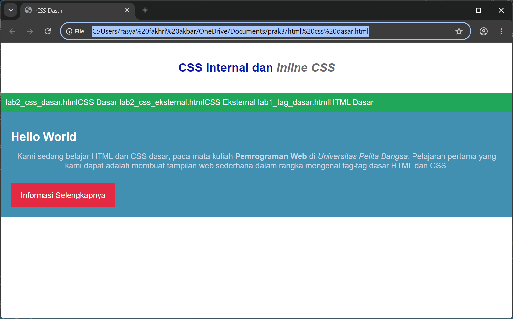

# Praktikum 3 - CSS Dasar

## Data Mahasiswa

- Nama : Rasya Fakhri Akbar
- NIM : 312310626
- Kelas : I251B

---

# Hasil Praktikum

Praktikum ini membahas penggunaan CSS Internal, Inline CSS, CSS Eksternal, serta penggunaan ID Selector dan Class Selector pada halaman web.

## Tampilan Akhir Program

Berikut merupakan hasil akhir praktikum yang telah dikerjakan.



---

# Jawaban Pertanyaan dan Tugas

## 1. Lakukan eksperimen dengan mengubah dan menambah properti CSS

Saya melakukan eksperimen dengan menambahkan properti berikut:

```css
.button {
    border-radius: 10px;
    box-shadow: 2px 2px 5px gray;
}
```

Hasilnya tombol menjadi lebih menarik karena memiliki sudut yang membulat dan efek bayangan.

---

## 2. Apa perbedaan pendeklarasian CSS `h1 {...}` dengan `#intro h1 {...}`?

Selector:

```css
h1 {
    color: blue;
}
```

akan diterapkan pada seluruh elemen `<h1>` yang ada di halaman.

Sedangkan:

```css
#intro h1 {
    color: white;
}
```

hanya berlaku pada elemen `<h1>` yang berada di dalam elemen dengan id `intro`.

---

## 3. Apabila ada deklarasi CSS Internal, Eksternal, dan Inline pada elemen yang sama, deklarasi manakah yang akan ditampilkan browser?

Urutan prioritas CSS adalah:

1. Inline CSS
2. Internal CSS
3. External CSS

Contoh:

```css
p {
    color: blue;
}
```

```html
<p style="color:red;">
    Hello World
</p>
```

Maka warna yang tampil adalah merah karena Inline CSS memiliki prioritas tertinggi.

---

## 4. Apabila sebuah elemen HTML memiliki ID dan Class, selector manakah yang diprioritaskan?

ID Selector memiliki prioritas lebih tinggi daripada Class Selector.

Contoh:

```html
<p id="paragraf-1" class="textparagraf">
    Contoh Paragraf
</p>
```

```css
.textparagraf {
    color: blue;
}

#paragraf-1 {
    color: red;
}
```

Hasil yang tampil adalah warna merah karena aturan ID Selector lebih spesifik.

---

# Kesimpulan

Pada praktikum ini telah dipelajari penggunaan CSS Internal, Inline CSS, dan CSS Eksternal dalam mengatur tampilan halaman web. Selain itu dipelajari juga penggunaan Element Selector, ID Selector, dan Class Selector untuk mengatur elemen HTML secara lebih spesifik.
